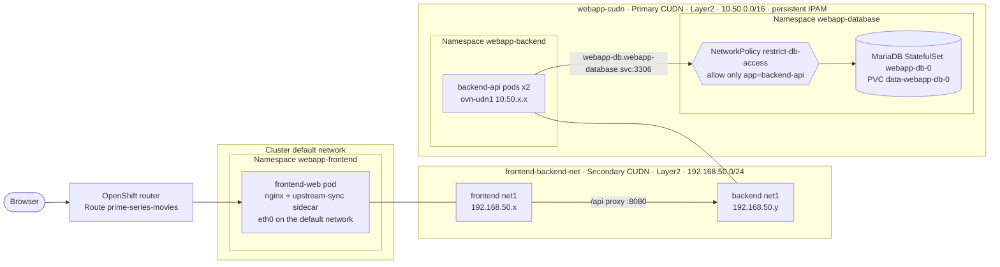
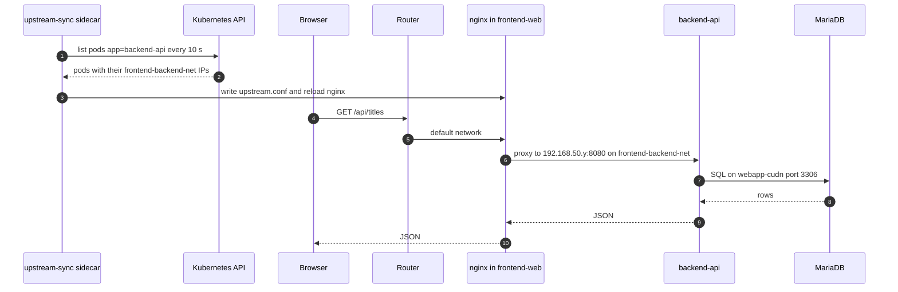
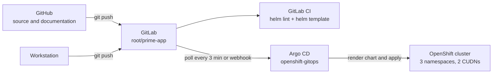
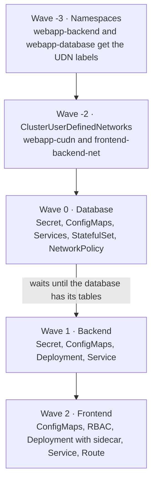

# Prime Series and Movies — three-tier app on OpenShift user-defined networks

A movies and series catalogue deployed as three isolated tiers on OpenShift: an nginx
**frontend**, a Python **backend** API and a **MariaDB** database. The tiers are separated
with OVN-Kubernetes **ClusterUserDefinedNetworks (CUDNs)** and a **NetworkPolicy**, packaged
as one **Helm chart**, and deployed with **Argo CD (OpenShift GitOps)** from **GitLab**.

Everything below is copy-and-paste. Replace values in `<angle brackets>` with your own.

---

## Contents

1. [Architecture](#1-architecture)
2. [Repository layout](#2-repository-layout)
3. [Prepare the environment](#3-prepare-the-environment)
4. [The networks and how they are created](#4-the-networks-and-how-they-are-created)
5. [Put the code in GitLab](#5-put-the-code-in-gitlab)
6. [Connect Argo CD and deploy](#6-connect-argo-cd-and-deploy)
7. [Verify](#7-verify)
8. [Day-2 operations](#8-day-2-operations)
9. [Configuration reference](#9-configuration-reference)
10. [Troubleshooting](#10-troubleshooting)
11. [Clean up](#11-clean-up)

---

## 1. Architecture

### Networks



| Network | Type | Subnet | Attached to | Purpose |
|---|---|---|---|---|
| Cluster default network | OVN-Kubernetes default | cluster pod CIDR | `webapp-frontend` | Route traffic from the router to the frontend |
| `webapp-cudn` | Primary CUDN, Layer2, persistent IPAM | `10.50.0.0/16` | every namespace labelled `app-tier=webapp` (`webapp-backend`, `webapp-database`) | Isolated network for backend ↔ database |
| `frontend-backend-net` | Secondary CUDN, Layer2 | `192.168.50.0/24` | `webapp-frontend`, `webapp-backend` (second interface `net1`) | The only path from the frontend to the backend |

### Who can reach what

| From → To | Result | Why |
|---|---|---|
| Browser → frontend | ✅ allowed | Route on the default network |
| Browser → backend | ❌ no path | The backend has no Route and sits on `webapp-cudn` |
| Frontend → backend `192.168.50.y:8080` | ✅ allowed | Shared secondary network `frontend-backend-net` |
| Frontend → backend Service or `10.50.x.x` | ❌ blocked | The frontend is not on `webapp-cudn` |
| Frontend → database | ❌ blocked | The frontend is not on `webapp-cudn` |
| Backend (`app=backend-api`) → database `:3306` | ✅ allowed | Same primary network + NetworkPolicy allows it |
| Any other pod on `webapp-cudn` → database | ❌ blocked | NetworkPolicy `restrict-db-access` |

### A request, end to end



Secondary-network IPs are not behind any Service, so the frontend cannot use a Service name
to reach the backend. The **upstream-sync** sidecar in the frontend pod watches the backend
pods, writes their `192.168.50.x` addresses into nginx's upstream and reloads nginx whenever
they change. Nothing needs to be done by hand after a deployment or a backend restart.

### GitOps flow



---

## 2. Repository layout

```
.
├── README.md                    this file
├── .gitlab-ci.yml               helm lint + template on every push
├── argocd/
│   ├── application.yaml         Argo CD Application (Helm source)
│   ├── rbac.yaml                lets Argo CD manage the CUDNs
│   └── repository.yaml          template for the GitLab repository Secret
├── charts/prime-app/
│   ├── Chart.yaml
│   ├── values.yaml              images, namespaces, networks, credentials, route
│   ├── files/                   app code and config, loaded into ConfigMaps
│   │   ├── frontend/            index.html, style.css, app.js, art.js, config.js,
│   │   │                        nginx.conf, upstream_sync.py
│   │   ├── backend/             app.py, PyMySQL wheel
│   │   └── database/            10-schema-and-seed.sh, 99-webapp.cnf
│   └── templates/
│       ├── platform/            namespaces + the two CUDNs
│       ├── database/            StatefulSet, Services, Secret, ConfigMaps, NetworkPolicy
│       ├── backend/             Deployment, Service, Secret, ConfigMaps
│       └── frontend/            Deployment + sidecar, RBAC, Service, Route, ConfigMaps
└── scripts/
    └── verify-tiers.sh          checks every tier and network path (PASS/FAIL)
```

---

## 3. Prepare the environment

Tested on OpenShift 4.18 with OVN-Kubernetes. Run everything from a workstation logged in as
a cluster administrator (`oc login ...`).

### 3.1 Check the cluster

```bash
oc version
oc get network.config cluster -o jsonpath='{.status.networkType}{"\n"}'     # OVNKubernetes
oc get crd clusteruserdefinednetworks.k8s.ovn.org                           # CUDN API present
oc get nodes
```

### 3.2 Check storage

The database needs a `ReadWriteOnce` volume. A default StorageClass must exist, or set
`database.storage.storageClassName` in `values.yaml`.

```bash
oc get storageclass          # one class should be marked (default)
```

### 3.3 Check the images can be pulled

Pods pull images through the nodes, so test from a worker node. `registry.redhat.io` is
authenticated through the cluster's global pull secret.

```bash
NODE=$(oc get nodes -l node-role.kubernetes.io/worker -o jsonpath='{.items[0].metadata.name}')
for img in quay.io/redhattraining/hello-world-nginx:latest \
           registry.access.redhat.com/ubi9/python-311:latest \
           registry.redhat.io/rhel9/mariadb-105:latest; do
  echo "== $img"
  oc debug node/$NODE -q -- chroot /host crictl pull "$img" | tail -1
done
```

Each line should end with `Image is up to date for ...`.

### 3.4 Install OpenShift GitOps (skip if already installed)

```bash
oc get argocd -n openshift-gitops 2>/dev/null || echo "OpenShift GitOps not installed"
```

To install it:

```bash
cat <<'EOF' | oc apply -f -
apiVersion: v1
kind: Namespace
metadata:
  name: openshift-gitops-operator
---
apiVersion: operators.coreos.com/v1
kind: OperatorGroup
metadata:
  name: openshift-gitops-operator
  namespace: openshift-gitops-operator
spec:
  upgradeStrategy: Default
---
apiVersion: operators.coreos.com/v1alpha1
kind: Subscription
metadata:
  name: openshift-gitops-operator
  namespace: openshift-gitops-operator
spec:
  channel: latest
  installPlanApproval: Automatic
  name: openshift-gitops-operator
  source: redhat-operators
  sourceNamespace: openshift-marketplace
EOF

# wait for the default Argo CD instance
until oc get argocd openshift-gitops -n openshift-gitops >/dev/null 2>&1; do sleep 10; done
oc get pods -n openshift-gitops
```

### 3.5 Let your OpenShift user see applications in the Argo CD UI

The default instance only shows applications to members of the `cluster-admins` group.

```bash
oc adm groups new cluster-admins 2>/dev/null
oc adm groups add-users cluster-admins "$(oc whoami)"
oc get argocd openshift-gitops -n openshift-gitops -o jsonpath='{.spec.rbac.policy}{"\n"}'
# should contain: g, cluster-admins, role:admin
```

Argo CD UI address (log in with **OpenShift**; log out and in again after changing groups):

```bash
oc get route openshift-gitops-server -n openshift-gitops -o jsonpath='https://{.spec.host}{"\n"}'
```

---

## 4. The networks and how they are created

The chart creates the namespaces, both CUDNs and the NetworkPolicy itself, in Argo CD
**sync waves** so that everything exists in the right order:



Two rules make the order matter:

- The `k8s.ovn.org/primary-user-defined-network` label only works if it is on the namespace
  **when the namespace is created**. It cannot be added later.
- A primary CUDN must exist **before** pods start in its namespaces, otherwise the pods stay on
  the default network.

The rendered objects look like this. You do not need to apply them when deploying with Argo
CD; they are here so you can see exactly what is created, or build the networks by hand.

### 4.1 Namespaces

```yaml
apiVersion: v1
kind: Namespace
metadata:
  name: webapp-frontend
  labels:
    argocd.argoproj.io/managed-by: openshift-gitops
---
apiVersion: v1
kind: Namespace
metadata:
  name: webapp-backend
  labels:
    argocd.argoproj.io/managed-by: openshift-gitops
    app-tier: webapp
    k8s.ovn.org/primary-user-defined-network: ""
---
apiVersion: v1
kind: Namespace
metadata:
  name: webapp-database
  labels:
    argocd.argoproj.io/managed-by: openshift-gitops
    app-tier: webapp
    k8s.ovn.org/primary-user-defined-network: ""
```

### 4.2 Primary CUDN for the backend and database tiers

```yaml
apiVersion: k8s.ovn.org/v1
kind: ClusterUserDefinedNetwork
metadata:
  name: webapp-cudn
spec:
  namespaceSelector:
    matchLabels:
      app-tier: webapp
  network:
    topology: Layer2
    layer2:
      role: Primary
      subnets:
        - "10.50.0.0/16"
      ipam:
        lifecycle: Persistent
```

### 4.3 Secondary CUDN shared by the frontend and backend

```yaml
apiVersion: k8s.ovn.org/v1
kind: ClusterUserDefinedNetwork
metadata:
  name: frontend-backend-net
spec:
  namespaceSelector:
    matchExpressions:
      - key: kubernetes.io/metadata.name
        operator: In
        values:
          - webapp-frontend
          - webapp-backend
  network:
    topology: Layer2
    layer2:
      role: Secondary
      subnets:
        - "192.168.50.0/24"
```

Pods join the secondary network through this annotation (already in the chart for the
frontend and backend Deployments):

```yaml
metadata:
  annotations:
    k8s.v1.cni.cncf.io/networks: frontend-backend-net
```

### 4.4 NetworkPolicy: only the backend may reach the database

```yaml
kind: NetworkPolicy
apiVersion: networking.k8s.io/v1
metadata:
  name: restrict-db-access
  namespace: webapp-database
spec:
  podSelector: {}
  policyTypes:
    - Ingress
  ingress:
    - from:
        - namespaceSelector:
            matchLabels:
              app-tier: webapp
          podSelector:
            matchLabels:
              app: backend-api
```

### 4.5 Check the networks after deployment

```bash
oc get clusteruserdefinednetworks
oc get network-attachment-definitions -A | grep -E 'webapp-cudn|frontend-backend-net'
oc get ns webapp-frontend webapp-backend webapp-database --show-labels

# interfaces and IPs of every pod
for ns in webapp-frontend webapp-backend webapp-database; do
  echo "== $ns"
  oc get pods -n $ns -o jsonpath='{range .items[*]}{.metadata.name}{"\n"}{.metadata.annotations.k8s\.v1\.cni\.cncf\.io/network-status}{"\n"}{end}'
done
```

Backend pods show `ovn-udn1` with `10.50.x.x` and `net1` with `192.168.50.x`; the database
pod shows `ovn-udn1` with `10.50.x.x`; the frontend pod shows its default-network address and
`net1` with `192.168.50.x`.

> **Subnet overlap:** in some lab environments the machine network is also
> `192.168.50.0/24`. Image pulls are unaffected (the node pulls), but from inside the frontend
> and backend pods any lab host in that range is reached through `net1` and fails. This app
> never contacts lab hosts from those pods. If you are free to choose, use a range such as
> `192.168.60.0/24` (`networks.secondary.subnet` in `values.yaml`).

---

## 5. Put the code in GitLab

GitHub holds the source and documentation; Argo CD deploys from the GitLab copy.

### 5.1 Create the GitLab project

In GitLab (`https://gitlab.apps.ocp4.example.com`): **New project → Create blank project**,
name `prime-app`, namespace `root`, and **untick "Initialize repository with a README"**.

### 5.2 Create two tokens

This GitLab uses **fine-grained personal access tokens**
(**User settings → Access → Personal access tokens → Generate token → Fine-grained token**):

| Token | Used by | Resource | Permissions |
|---|---|---|---|
| `workstation-push` | you, for `git push` | project `root/prime-app` | **Code: Download** and **Code: Push** |
| `argocd-read` | Argo CD | project `root/prime-app` | **Code: Download** only |

Instead of `argocd-read` you can use a project **deploy token**
(**Project → Settings → Repository → Deploy tokens**, scope `read_repository`); GitLab then
gives you a username such as `gitlab+deploy-token-1`.

Copy each token when it is created; GitLab shows it only once.

### 5.3 Clone from GitHub and push to GitLab

```bash
git clone https://github.com/<github-user>/prime-app.git
cd prime-app

git remote add gitlab https://root@gitlab.apps.ocp4.example.com/root/prime-app.git
git config http.https://gitlab.apps.ocp4.example.com/.sslVerify false   # lab self-signed cert

git push -u gitlab main          # Password: the workstation-push token
```

The GitLab project page should show `argocd/`, `charts/prime-app`, `scripts/`, `.gitignore`,
`.gitlab-ci.yml` and `README.md` at the top level. If a runner is available, a pipeline appears
under **Build → Pipelines**.

---

## 6. Connect Argo CD and deploy

### 6.1 Test the Argo CD token first

```bash
git -c http.sslVerify=false ls-remote \
  https://root:'<argocd-read-token>'@gitlab.apps.ocp4.example.com/root/prime-app.git
```

It must list `refs/heads/main`. (With a deploy token, use its username instead of `root`.)

### 6.2 Register the repository in Argo CD

Created from the command line so the token never lands in a file you might commit:

```bash
oc create secret generic repo-prime-app -n openshift-gitops \
  --from-literal=type=git \
  --from-literal=url=https://gitlab.apps.ocp4.example.com/root/prime-app.git \
  --from-literal=username=root \
  --from-literal=password='<argocd-read-token>' \
  --from-literal=insecure=true
oc label secret repo-prime-app -n openshift-gitops argocd.argoproj.io/secret-type=repository
```

### 6.3 Let Argo CD manage the CUDNs

The namespaced objects are covered by the `argocd.argoproj.io/managed-by` label the chart
puts on each namespace; the cluster-scoped CUDNs need this ClusterRole:

```bash
cat <<'EOF' | oc apply -f -
apiVersion: rbac.authorization.k8s.io/v1
kind: ClusterRole
metadata:
  name: prime-app-argocd
rules:
  - apiGroups: ["k8s.ovn.org"]
    resources: ["clusteruserdefinednetworks"]
    verbs: ["get", "list", "watch", "create", "update", "patch", "delete"]
  - apiGroups: [""]
    resources: ["namespaces"]
    verbs: ["get", "list", "watch", "create", "update", "patch"]
---
apiVersion: rbac.authorization.k8s.io/v1
kind: ClusterRoleBinding
metadata:
  name: prime-app-argocd
roleRef:
  apiGroup: rbac.authorization.k8s.io
  kind: ClusterRole
  name: prime-app-argocd
subjects:
  - kind: ServiceAccount
    name: openshift-gitops-argocd-application-controller
    namespace: openshift-gitops
EOF
```

### 6.4 Create the Application

```bash
cat <<'EOF' | oc apply -f -
apiVersion: argoproj.io/v1alpha1
kind: Application
metadata:
  name: prime-app
  namespace: openshift-gitops
spec:
  project: default
  source:
    repoURL: https://gitlab.apps.ocp4.example.com/root/prime-app.git
    targetRevision: main
    path: charts/prime-app
    helm:
      releaseName: prime-app
      valueFiles:
        - values.yaml
  destination:
    server: https://kubernetes.default.svc
    namespace: webapp-frontend
  syncPolicy:
    automated:
      prune: true
      selfHeal: true
    syncOptions:
      - CreateNamespace=false
      - PruneLast=true
    retry:
      limit: 10
      backoff:
        duration: 10s
        factor: 2
        maxDuration: 3m
EOF
```

### 6.5 Watch the sync

```bash
oc get application prime-app -n openshift-gitops -w       # wait for Synced / Healthy

# details, or the error if it is stuck
oc get application prime-app -n openshift-gitops \
  -o jsonpath='{.status.sync.status}{" / "}{.status.health.status}{"\n"}{.status.conditions[*].message}{"\n"}'
```

The first sync takes a few minutes. One or two `forbidden` retries at the start are normal
while the GitOps operator grants Argo CD access to the new namespaces.

---

## 7. Verify

### 7.1 Argo CD

```bash
oc get application prime-app -n openshift-gitops
oc get application prime-app -n openshift-gitops \
  -o jsonpath='{range .status.resources[*]}{.kind}{"\t"}{.namespace}{"\t"}{.name}{"\t"}{.status}{"\t"}{.health.status}{"\n"}{end}' | column -t
```

### 7.2 Pods

```bash
oc get pods -n webapp-database     # webapp-db-0            1/1 Running
oc get pods -n webapp-backend      # backend-api-...  x2    1/1 Running
oc get pods -n webapp-frontend     # frontend-web-...       2/2 Running  (nginx + upstream-sync)

oc logs -n webapp-frontend deploy/frontend-web -c upstream-sync
# ... backend upstream -> 192.168.50.x, 192.168.50.y
```

### 7.3 End to end

```bash
HOST=$(oc get route prime-series-movies -n webapp-frontend -o jsonpath='{.spec.host}')
echo "http://$HOST"
curl -s "http://$HOST/api/health"; echo
# {"status": "ok", "database": "up", ..., "titles": 16}
```

Open the site: the footer reads **"Backend connected: 16 titles from MariaDB 10.5"**. Save a
title to *My list*, reload, and it is still there (stored in the database).

### 7.4 Every network path

```bash
chmod +x scripts/verify-tiers.sh
./scripts/verify-tiers.sh
```

It checks each row of the [Who can reach what](#who-can-reach-what) table and ends with
`N passed, 0 failed`. It starts two short-lived test pods to prove the NetworkPolicy: the same
pod is blocked with `app=something-else` and allowed with `app=backend-api`.

---

## 8. Day-2 operations

### Change anything through Git

```bash
sed -i 's/^  replicas: 2$/  replicas: 3/' charts/prime-app/values.yaml     # backend replicas
git commit -am "Scale backend to 3" && git push gitlab main

# sync now instead of waiting for the 3-minute poll
oc annotate application prime-app -n openshift-gitops argocd.argoproj.io/refresh=normal --overwrite
oc get pods -n webapp-backend -w
```

For instant syncs, add a GitLab webhook: **Project → Settings → Webhooks**, URL
`https://<argocd-server-route>/api/webhook`, trigger **Push events**.

### Watch self-heal undo a manual change

```bash
oc scale deploy/backend-api -n webapp-backend --replicas=5
oc get deploy backend-api -n webapp-backend -w           # goes back to the value in Git
```

### Watch the sidecar follow the backend

```bash
oc delete pod -n webapp-backend -l app=backend-api --wait=false
oc logs -n webapp-frontend deploy/frontend-web -c upstream-sync -f   # new IPs + "reloaded nginx"
```

### Add a title straight in the database

```bash
oc exec -n webapp-database webapp-db-0 -- sh -c 'MYSQL_PWD="$MYSQL_PASSWORD" mysql -h 127.0.0.1 -u "$MYSQL_USER" "$MYSQL_DATABASE" -e "
INSERT INTO titles (id, kind, title, year, rating, minutes, genres, plot)
VALUES (17, \"movie\", \"Nile After Midnight\", 2026, 8.7, 109, \"Thriller,Drama\",
        \"A felucca captain witnesses something on the river that half of Cairo wants forgotten.\")"'
```

Reload the site: the title appears in the rows and in search.

### Real poster photos (optional)

Put JPEGs named `1.jpg` … `16.jpg` (portrait 2:3, whole set under ~900 KB) in `posters/`:

```bash
oc create configmap frontend-posters -n webapp-frontend --from-file=posters/
oc rollout restart deployment/frontend-web -n webapp-frontend
```

Titles without a photo keep their illustrated artwork.

---

## 9. Configuration reference

Main settings in `charts/prime-app/values.yaml`:

| Key | Default | Meaning |
|---|---|---|
| `namespaces.frontend / backend / database` | `webapp-frontend` / `webapp-backend` / `webapp-database` | Namespaces for the three tiers |
| `namespaces.argocdManagedBy` | `openshift-gitops` | Argo CD instance allowed to manage them (`""` to skip) |
| `networks.primary.subnet` | `10.50.0.0/16` | `webapp-cudn` subnet |
| `networks.secondary.subnet` | `192.168.50.0/24` | `frontend-backend-net` subnet |
| `database.image` | `registry.redhat.io/rhel9/mariadb-105:latest` | MariaDB image |
| `database.storage.size / storageClassName` | `5Gi` / `""` (default class) | Database volume |
| `database.existingSecret` | `""` | Use your own DB Secret instead of the chart's |
| `backend.image` | `registry.access.redhat.com/ubi9/python-311:latest` | API image |
| `backend.replicas` | `2` | Backend pods |
| `backend.existingSecret` | `""` | Use your own backend Secret instead of the chart's |
| `frontend.image` | `quay.io/redhattraining/hello-world-nginx:latest` | nginx image |
| `frontend.route.name` | `prime-series-movies` | Route name |
| `frontend.route.tls.enabled` | `false` | `true` = edge TLS with HTTP → HTTPS redirect |
| `frontend.upstreamSync.intervalSeconds` | `10` | How often the sidecar checks the backend pods |

**Credentials:** `values.yaml` contains lab passwords so the chart works out of the box. For
anything real, create the Secrets yourself (Sealed Secrets, External Secrets, Vault…) and set
`database.existingSecret` and `backend.existingSecret`:

```bash
oc create secret generic my-db-secret -n webapp-database \
  --from-literal=MYSQL_USER=primeapp --from-literal=MYSQL_PASSWORD='<password>' \
  --from-literal=MYSQL_ROOT_PASSWORD='<root-password>' --from-literal=MYSQL_DATABASE=primedb
oc create secret generic my-backend-secret -n webapp-backend \
  --from-literal=DB_USER=primeapp --from-literal=DB_PASSWORD='<password>'
```

---

## 10. Troubleshooting

| Symptom | Cause | Fix |
|---|---|---|
| `ErrImagePull … lookup <registry>: no such host` | Registry name from another environment | Use images the nodes can reach ([3.3](#33-check-the-images-can-be-pulled)) |
| `x509: certificate is valid for git.ocp4.example.com, not registry…` | Registry port missing, so port 443 (Git server) was hit | Add the port, e.g. `registry.ocp4.example.com:8443/...` |
| `unauthorized: access to the requested resource is not authorized` | Image not in that registry, or private | Check the path; Quay answers "unauthorized" for missing repos too |
| `This repo requires terms acceptance and is only available on registry.redhat.io` | RHEL image requested from `registry.access.redhat.com` | Use `registry.redhat.io/...` (global pull secret) |
| `CreateContainerError … does not resolve to an image ID` | Broken image entry in CRI-O storage on the node | `oc debug node/<node> -- chroot /host crictl rmi <image>` then delete the pod |
| `Table 'primedb.titles' doesn't exist` | Schema not loaded | The StatefulSet's postStart hook loads it on start; see the command below |
| PVC `data-webapp-db-0` stays `Pending` | No default StorageClass | Set `database.storage.storageClassName` |
| `git push`: `HTTP Basic: Access denied` | Password used instead of a token | Use a personal access token ([5.2](#52-create-two-tokens)) |
| `git push`: `requires … permissions: [Code: Push]` / `[Code: Download]` | Fine-grained token missing a permission | Add **Code: Push** and **Code: Download** |
| `! [rejected] main -> main (fetch first)` | GitLab project was created with a README | `git pull gitlab main --allow-unrelated-histories --no-rebase -X ours --no-edit`, then push |
| Argo CD UI shows no applications | User not in `cluster-admins` | [3.5](#35-let-your-openshift-user-see-applications-in-the-argo-cd-ui), then log out and in |
| Application `Unknown`: `failed to list refs: authentication required` | Wrong token or repository Secret | Test with `git ls-remote` ([6.1](#61-test-the-argo-cd-token-first)) and recreate the Secret |
| First sync: `… is forbidden: User "system:serviceaccount:openshift-gitops:…"` | Namespaces just created, RBAC not granted yet | Wait for the retry; check the `argocd.argoproj.io/managed-by` label |
| Site footer: "Backend not reachable" | No ready backend pods, or sidecar can't list them | `oc logs deploy/frontend-web -c upstream-sync -n webapp-frontend` |
| Health says `"database": "down"` | Backend can't reach MariaDB | `oc logs deploy/backend-api -n webapp-backend --tail=20`; check pod label `app=backend-api` |

Load the database schema by hand (safe to repeat):

```bash
oc get configmap webapp-db-init -n webapp-database -o jsonpath='{.data.10-schema-and-seed\.sh}' |
  oc exec -i -n webapp-database webapp-db-0 -- bash -c \
  'export MYSQL_PWD="$MYSQL_PASSWORD"; mysql_flags="-h 127.0.0.1 -u $MYSQL_USER"; source /dev/stdin'
```

---

## 11. Clean up

Namespaces and CUDNs are marked `Prune=false,Delete=false`, so deleting the Application alone
leaves them (and the database volume) in place. To remove everything:

```bash
oc delete application prime-app -n openshift-gitops

# namespaces first (removes all workloads and the database PVC), then the networks
oc delete namespace webapp-frontend webapp-backend webapp-database
oc delete clusteruserdefinednetwork frontend-backend-net webapp-cudn

oc delete clusterrolebinding prime-app-argocd
oc delete clusterrole prime-app-argocd
oc delete secret repo-prime-app -n openshift-gitops
```
